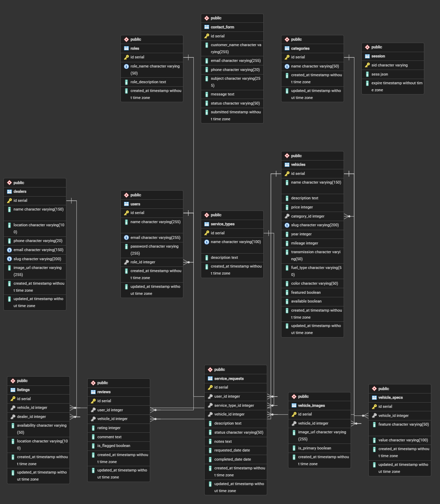

# 🚗 Used Car Dealership Application

A full-featured used car dealership web application built with Node.js, Express, EJS, and PostgreSQL. Users can browse inventory, leave reviews, manage favorites, track service requests, and compare vehicles side by side.

---

## 📋 Table of Contents

- [Technology Stack](#technology-stack)
- [Live Demo](#live-demo)
- [Features](#features)
- [Database Schema](#database-schema)
- [User Roles](#user-roles)
- [Installation & Setup](#installation--setup)
- [Test Accounts](#test-accounts)
- [Project Structure](#project-structure)
- [Screenshots](#screenshots)
- [Known Limitations](#known-limitations)
- [Future Improvements](#future-improvements)
- [What I Learned](#what-i-learned)

---

## 🛠️ Technology Stack

| Technology | Purpose |
|------------|---------|
| **Node.js** | Runtime environment |
| **Express.js** | Backend framework |
| **EJS** | Server-side templating |
| **PostgreSQL** | Relational database |
| **ESM (ES Modules)** | Module system (no CommonJS/require) |
| **Render** | Deployment platform |
| **bcrypt** | Password hashing |
| **express-session** | Session management |
| **CSS Variables** | Dark mode support |

---

## 🌐 Live Demo

> **URL:** [https://cse340-used-car-dealership-ym5u.onrender.com](https://cse340-used-car-dealership-ym5u.onrender.com)

---

## ✨ Features

### 🔐 Authentication & Authorization
- User registration and login with secure password hashing
- Role-based access control (Customer, Employee, Owner)
- Session management with express-session
- Flash messages for user feedback

### 🚗 Vehicle Management
- Browse vehicles with search, category filters, and sorting
- View detailed vehicle specifications and images
- Dealer inventory display
- Vehicle comparison (up to 3 vehicles side by side)
- Vehicle search functionality

### ❤️ Favorites
- Save favorite vehicles to your personal list
- View and manage favorites from dashboard
- Quick access to favorites from navigation

### ⭐ Reviews
- Submit and manage vehicle reviews
- Star rating system (1-5)
- Review analytics with rating breakdown
- Edit and delete your own reviews

### 🔧 Service Requests
- Submit service requests for vehicles
- Track request status (Submitted, In Progress, Completed)
- Employee management interface
- View request history

### 📊 Dashboard Analytics
- **Customer Dashboard:** Favorites count, Reviews submitted, Service requests
- **Employee Dashboard:** Open inquiries, Pending requests, Total vehicles
- **Owner Dashboard:** Total users, Total vehicles, Total dealers, Total reviews

### 🌙 Dark Mode
- Toggle between light and dark themes
- Persistent preference using localStorage
- Professional, accessible design

### 📱 Responsive Design
- Mobile-first approach
- Hamburger menu navigation
- Optimized for all screen sizes

---

## 🗄️ Database Schema



*Entity-Relationship Diagram showing the database structure and relationships between tables.*

### Core Tables

| Table | Description |
|-------|-------------|
| `users` | User accounts with role-based permissions |
| `roles` | Role definitions (customer, employee, owner) |
| `vehicles` | Vehicle inventory with specifications |
| `categories` | Vehicle categories (Car, SUV, Truck, etc.) |
| `dealers` | Dealership information |
| `listings` | Vehicle-dealer relationships |
| `favorites` | User favorite vehicles (many-to-many) |
| `reviews` | Vehicle reviews and ratings |
| `service_requests` | User service requests |
| `contact_form` | Customer inquiries |
| `vehicle_images` | Vehicle image gallery |
| `vehicle_specs` | Vehicle specifications |

---

## 👤 User Roles

| Role | Permissions |
|------|-------------|
| **Owner/Admin** | Full system control - manage users, vehicles, categories, dealers, and all content |
| **Employee** | Edit vehicle details, moderate reviews, manage service requests, view contact inquiries |
| **Customer** | Browse vehicles, leave reviews, submit service requests, manage favorites, view dashboard |

---

## 🚀 Installation & Setup

### Prerequisites

- Node.js (v16 or higher)
- PostgreSQL (v14 or higher)

### Installation Steps

1. **Clone the repository**
```bash
git clone https://github.com/jesustortoleroh/cse340-used-car-dealership.git
cd cse340-used-car-dealership